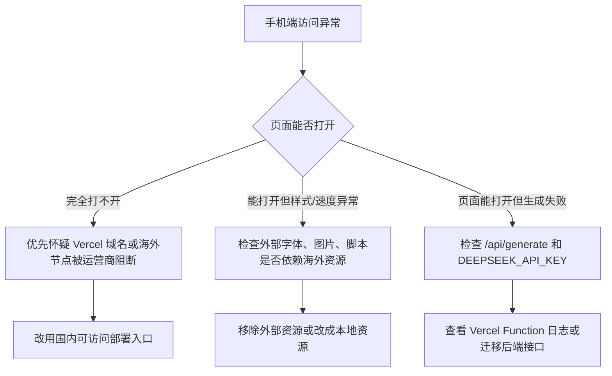

# 成长市集创意盲盒 H5

这是一个面向 Vercel 部署的 Next.js 14 H5 应用。前端由 Claude Design 导出的 React 原型迁移而来，已改成 Next.js 生产组件，并接入 DeepSeek 流式生成接口。

## 技术栈

- Next.js 14 App Router
- TypeScript
- Tailwind CSS
- npm

## 本地运行

```bash
npm install
npm run dev
```

默认访问地址：

```text
http://localhost:3000
```

## 环境变量

本地使用 `.env.local`：

```bash
DEEPSEEK_API_KEY=
```

部署到 Vercel 时，在项目 Environment Variables 中配置同名变量：

```bash
DEEPSEEK_API_KEY
```

## API

### `POST /api/generate`

接收 5 个问题的用户输入，调用 DeepSeek V4-pro（API 模型 ID：`deepseek-v4-pro`），并以 SSE 流式返回生成结果。

请求体：

```json
{
  "answers": [
    "回答 1",
    "回答 2",
    "回答 3",
    "回答 4",
    "回答 5"
  ]
}
```

成功响应为 `text/event-stream`，事件格式：

```text
event: chunk
data: {"content":"..."}

event: done
data: {"done":true}
```

前端需要持续拼接所有 `chunk.content`，最后得到一个 JSON 字符串。目标 JSON 结构：

```json
{
  "concepts": [
    {
      "concept_name": "概念命名",
      "one_liner": "一句话概念",
      "core_interaction": "核心互动",
      "why_you": "为什么是「你」",
      "takeaway": "他人带走的礼物"
    }
  ]
}
```

接口会校验 `answers` 必须正好是 5 条非空字符串。无效输入返回 `400`；缺少 `DEEPSEEK_API_KEY` 返回 `500`，不会调用外部 API。

## 前端结构

主要页面和组件：

```text
src/app/page.tsx
src/components/CreativeBlindBoxApp.tsx
src/components/screens/InputScreen.tsx
src/components/screens/AnimationScreen.tsx
src/components/screens/ResultScreen.tsx
src/components/doodles.tsx
src/lib/concepts.ts
src/lib/sound-effects.ts
```

当前交互流程：

```mermaid
flowchart TD
    A[填写 5 个问题] --> B[开启盲盒]
    B --> C[3 秒盲盒动画]
    C --> D[进入结果页]
    B --> E[/api/generate SSE]
    E --> F[逐步解析 concepts JSON]
    F --> G[逐步渲染概念卡片]
    G --> H[保存我的灵感]
    H --> I[生成 PNG 长图或调用系统分享]
```

说明：

- 原型里的全局 `window.*` 组件已经改成 ES Module import/export。
- 前端保留了第 3-5 题选填体验；提交给 API 时，空选填项会转成 `（用户未填写）`，以满足后端 5 条非空输入校验。
- `保存我的灵感` 使用 Canvas 生成 PNG 长图，并在页面内弹出预览。移动端可长按保存，也可以点 `下载 PNG`。
- UI 音效来自 Kenney Interface Sounds，许可为 Creative Commons CC0；文件放在 `public/audio/`。不支持 OGG 的浏览器会退回到 Web Audio 短音。

## 常用命令

```bash
npm run lint
npm run build
```

## Vercel 部署

1. 把项目推到 GitHub。
2. 在 Vercel 新建项目并导入该仓库。
3. Framework Preset 选择 `Next.js`，Build Command 保持 `npm run build`。
4. 在 Vercel 项目设置里添加环境变量：

```bash
DEEPSEEK_API_KEY=你的 DeepSeek API Key
```

5. 部署完成后，用手机打开 Vercel 域名测试完整流程。

## 国内手机端访问建议

如果手机不连 VPN 无法稳定打开，优先按下面顺序排查：



当前项目已经移除 Google Fonts 外部字体依赖，页面静态资源不再依赖 Google。

更稳定的正式方案是把 H5 部署到国内或国内访问更稳定的服务：

- 推荐：腾讯云 CloudBase / EdgeOne Pages + 云函数，前端和 `/api/generate` 都在国内链路。
- 备选：阿里云函数计算 + OSS / CDN。
- 临时：继续用 Vercel，但绑定自有域名并测试移动、电信、联通三网；这只能缓解，不能保证国内手机端长期稳定。

这个项目不是纯静态页，`/api/generate` 需要服务端环境变量 `DEEPSEEK_API_KEY`，所以不能只把 `out/` 上传到普通静态空间，否则生成接口会失效。

部署前本地检查：

```bash
npm run lint
npm run build
```
